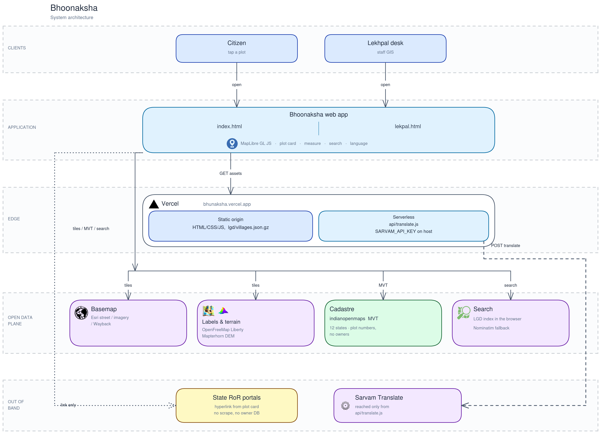

# Bhoonaksha

Static web map for Indian cadastral plots. No bundler, no framework.

Live: https://bhoonaksha.vercel.app



The map runs in the browser (citizen and Lekhpal pages) on a Vercel static origin plus one translate function. Basemap, labels, terrain, and cadastral tiles come from open APIs; state RoR is a hyperlink off the plot card, not a scrape.


## Stack

| Piece | What |
|---|---|
| Map | [MapLibre GL JS](https://maplibre.org/) 4.7 (`hash: true`) |
| Street / satellite | Esri World Street Map, Esri World Imagery (`maxzoom` 17, overzoom above that) |
| Historical satellite | Esri Wayback, years 2014–2026 |
| DEM / terrain | [Mapterhorn](https://mapterhorn.com/) Terrarium WebP |
| Place labels | OpenFreeMap Liberty vector, attached over the raster |
| Survey plots | Vector tiles from [indianopenmaps](https://indianopenmaps.com/) (MVT) |
| Village search | Bundled LGD dump (`lgd/villages.json.gz`) in a Web Worker; Nominatim fallback |
| Reverse / OSM extras | Nominatim, Overpass |
| Plot IDs | DIGIPIN encoder/decoder (`js/digipin.js`) |
| Translation | Sarvam Translate via `api/translate.js` (Vercel serverless). Key is `SARVAM_API_KEY` on the host, never in the client |
| Hosting | Vercel static + one function |

## Pages

- `index.html` — citizen map
- `lekpal.html` — staff GIS desk (identify, shapefile, 3D, catalogue)

Scripts are plain IIFEs under `js/`. Shared CSS in `css/app.css`; desk extras in `css/lekpal.css`.

## Layout

```
index.html          lekpal.html
css/                js/
api/translate.js    Vercel function for Sarvam
lgd/villages.json.gz  LGD village index (gzip JSON)
data/DATA.md        notes on the optional SQLite village DB
scripts/build_db.py rebuilds `data/mera.sqlite` from LGD dumps (not required in prod)
server.py           local static server + `/api/search` against SQLite if present
vercel.json         cache headers
```

Cache-bust query is `?v=` on script and CSS links. Bump it when shipping.

## Cadastral tiles

Keyless MVT from indianopenmaps, drawn after closer zoom:

Andhra Pradesh, Tamil Nadu, Kerala, Telangana, Karnataka, Maharashtra, Odisha, Haryana, Madhya Pradesh, Goa, Assam, Jharkhand.

Plot numbers use the source attributes (`KIDE` in Jharkhand, `revenue_plot` in Odisha, etc.). There is no owner / khata / ULPIN feed in this repo.

## Run locally

```bash
python3 server.py
```

Serves `127.0.0.1:8765`. If `data/mera.sqlite` is missing, search still works from the gzip LGD index in the browser.

Any static server also works for the map itself (`python3 -m http.server`). Translation needs the Vercel function or an env `SARVAM_API_KEY` in front of `api/translate.js`.

## Deploy

Production: https://bhoonaksha.vercel.app  
Vercel project `bhoonaksha` is linked to this repo (`saurabh4269/bhoonaksha`). Pushes to `main` deploy production.

```bash
git push origin main
# or one-off from a checkout:
vercel deploy --prod
```

**GitHub Actions** (optional; templates in `ci/`). A repo admin runs this once (`gh` with the `workflow` scope + `vercel login`):

```bash
./scripts/enable-vercel-github-ci.sh
```

That copies the workflows into `.github/workflows/` and writes the `VERCEL_TOKEN` secret. After that, every push to `main` and every pull request deploys from Actions.

Set `SARVAM_API_KEY` on the Vercel project if you want live translation. Do not commit `.vercel`, `bin-cloudflared`, or `data/*.sqlite`.
